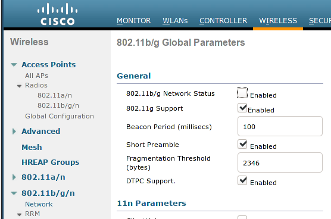
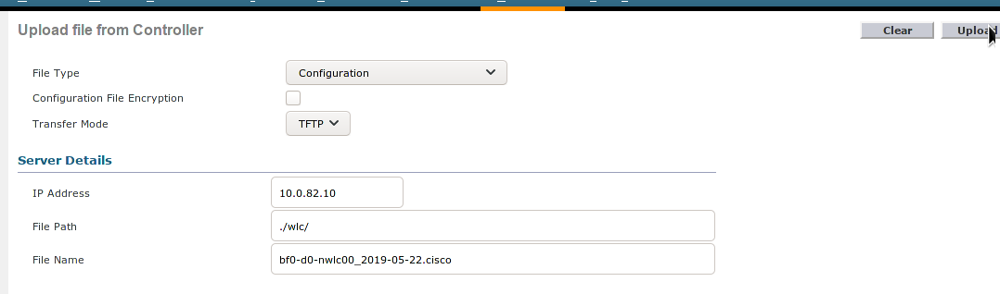
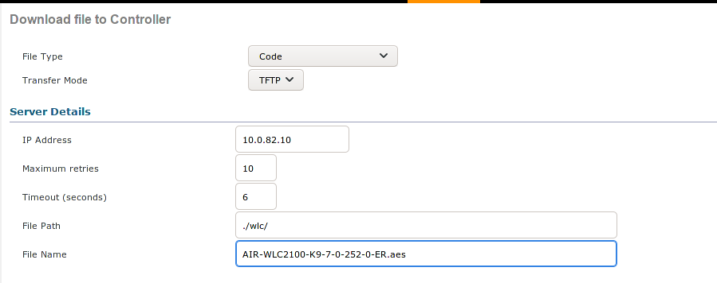
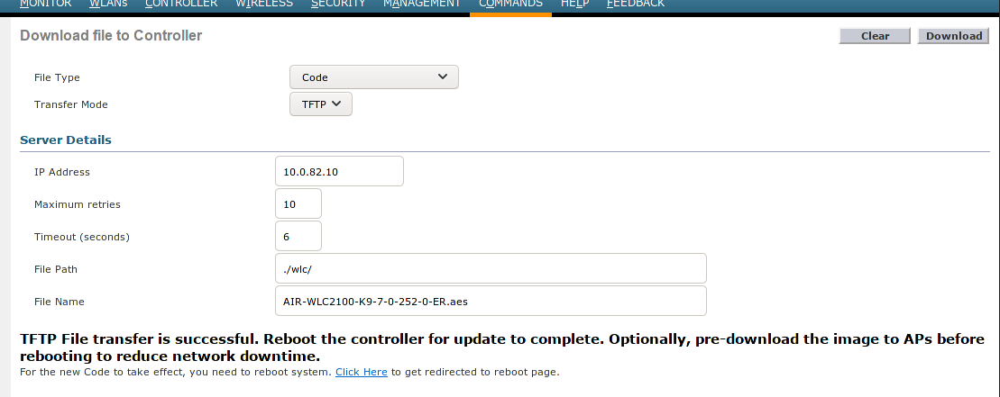
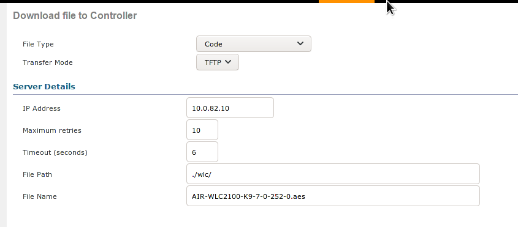
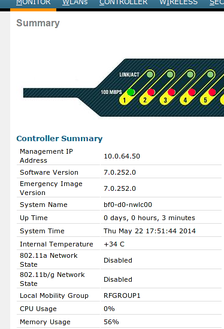

You'll need to have a working local tftp server for this to work. The readme in the `../setup/tftp/` folder within this repo covers how to get this going properly on Gentoo.

# Catalyst 3560G 

1. Connect to the switch via the console port. Ideally, use a USB-to-serial adapter.

    ```bash
    screen /dev/ttyUSB0 9600,cs8,-parenb,-cstopb
    ```
2. Start a tftp server which has a mount point at `/tftp/`
3. Copy the switch image file to `/tftp` and change mod to 777 and ownership to nobody:root.
4. Perform a safe download of the specified files.

    ```bash
    archive download-sw /safe tftp://<ip>/<image-file>
    ```
    *Note that you do not need to specify `/tftp/` as it is the root of the mount*

This document primarily references upgrading to IOS 12.2(55)SE. Release notes can be found [here](http://www.cisco.com/c/en/us/td/docs/switches/lan/catalyst3750/software/release/12-2_55_se/release/notes/OL23054.html#21027)

Another upgrade approach is detailed [here](https://www.packet6.com/how-to-upgrade-the-ios-of-a-cisco-switch/).

# Helpful Notes

* [Information about screen](http://www.noah.org/wiki/Screen_notes)
* [Connecting with putty](http://www.omnisecu.com/cisco-certified-network-associate-ccna/how-to-use-putty-to-configure-or-monitor-a-cisco-router-or-switch.php)

# Cisco WLC

1. Ensure both the image and the ER file are present in the `/tftp` directory on the server.
1. Correct the permissions on both files

    ```bash
    #as root
    TFTP_DIR="/tftp"
    find "${TFTP_DIR}" -exec chown nobody:root {} \;
    find "${TFTP_DIR}" -exec chmod 777 {} \;
    ```
1. Create a directory for the WLC to store stuff.

    ```bash
    WLC_DIR="${TFTP_DIR}/wlc"
    mkdir -p "${WLC_DIR}"
    chown nobody:root "${WLC_DIR}"
    chmod 777 "${WLC_DIR}"
    ```
1. Log into the WLC web interface.
1. Open **Wireless -> 802.11b/g/n -> Network** and uncheck the *802.11b/g Network Status* on the general tab.

    
1. Create the target file with the appropriate permissions

    ```bash
    TARGET="${WLC_DIR}/bf0-d0-nwlc00_2019-05-22.cisco"
    touch "${TARGET}"
    find "${TFTP_DIR}" -exec chown nobody:root {} \;
    find "${TFTP_DIR}" -exec chmod 777 {} \;
    ```
1. Open **Commands -> Upload File** and download the current config. Click OK on the warning about encryption.

    
1. Open **Commands -> Download File** and download the boot image which should end in *ER.aes*.
    
    
1. Once the process completes successfully choose the option to reboot the controller. If prompted, save config.
    
    
1. Repeat the process for the other file.

    
1. Verify that the update was successful on the Monitor summary page.
    
    
1. Finally, re-enable the 802.11b/g network which was disabled earlier.
