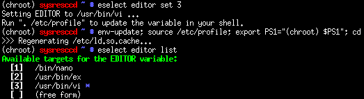
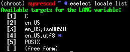
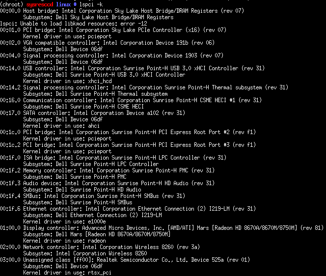
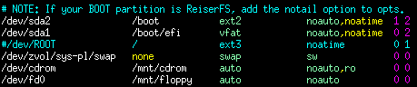
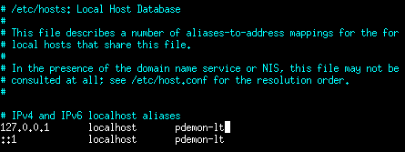
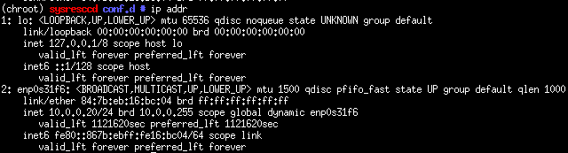
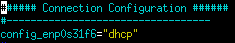

# File Systems

Useful Definitions
```bash
DISK1="/dev/sda"
POOL="sys-pl"
```

## Partitioning

Create the partition table on the primary hard disk. Note that it should be optimally aligned. Also, switch to mebibytes.

```bash
parted -a optimal "${DISK1}"
unit mib
mklabel gpt
```
From within parted create a 500 MiB file system for Grub's EFI implementation. 

Parted `set boot on` flags the partition for EFI system use.

```bash
mkpart primary 1 501
name 1 efi
set 1 boot on
```

Create partitions for Kernel files and leave the remainder for root.

```bash
mkpart primary 501 629
name 2 boot

mkpart primary 629 -1
name 3 root
```

## Formatting

Specific components of the system require certain file system types. In particular, the EFI System Partition must be FAT32.

```bash
mkdosfs -F 32 -n EFI "${DISK1}1"
```
The kernel file system is primarily read-only so we may as well use ext2.
```bash
mkfs.ext2 -T small "${DISK1}2"
```

### Crypto

Create and open the crypto vault

```bash
cryptsetup -c twofish-xts-essiv:sha256 -s 512 luksFormat "${DISK1}3"
```

You'll be asked the following
1. Are you sure you want to overwrite? YES
2. Enter your passphrase

Now open the libary

```bash
cryptsetup luksOpen "${DISK1}"3 "${POOL}-crypt0"
```

Based on:
https://thestaticvoid.com/post/2013/10/26/how-i-do-encrypted-mirrored-zfs-root-on-linux/
https://wiki.gentoo.org/wiki/DM-Crypt_LUKS

### ZFS Filesystems

Create the base filesystem. Eventually this should be mirrored, but whatever.

```bash
zpool create -o ashift=12 -o autoexpand=on -o feature@lz4_compress=enabled \
    -o cachefile=/tmp/zpool.cache \
    -O normalization=formD -m none -R /mnt/gentoo "${POOL}" \
    "${POOL}-crypt0"
```

Create our filesystems

```bash
#Swap
zfs create "${POOL}/swap" -V 8G -b 4K
mkswap "/dev/${POOL}/swap"

# Root
zfs create -o mountpoint=none ${POOL}/ROOT
zfs create -o mountpoint=/ -o compression=lz4 ${POOL}/ROOT/gentoo

# home
zfs create -o mountpoint=/home -o compression=lz4 ${POOL}/HOME

# portage
zfs create -o mountpoint=none ${POOL}/GENTOO
zfs create -o mountpoint=/usr/portage -o compression=lz4 ${POOL}/GENTOO/portage
zfs create -o mountpoint=/usr/portage/distfiles ${POOL}/GENTOO/distfiles

# portage (build)
# Extra settings like sync off & compression
zfs create -o mountpoint=/var/tmp/portage -o compression=lz4 -o sync=disabled ${POOL}/GENTOO/build-dir

# packages
zfs create -o mountpoint=/usr/portage/packages ${POOL}/GENTOO/packages

# ccache directory
zfs create -o mountpoint=/var/tmp/ccache -o compression=lz4 ${POOL}/GENTOO/ccache
```

## Turn on Swap

```bash
swapon "/dev/${POOL}/swap"
```

# Collect Sources 

Go to the mount point

```bash
cd /mnt/gentoo
```

Download Sources

```bash
wget http://lug.mtu.edu/gentoo/releases/amd64/autobuilds/current-stage3-amd64/stage3-amd64-20160602.tar.bz2
wget http://lug.mtu.edu/gentoo/releases/amd64/autobuilds/current-stage3-amd64/stage3-amd64-20160602.tar.bz2.DIGESTS
```

Now that we have the sources, check them out for corruption

```bash
grep --color $(openssl dgst -r -sha512 stage3-amd64-*.tar.bz2 | awk '{print $1}') stage3-amd64-*.tar.bz2.DIGESTS
```
Extract the tarball

```bash
tar xvjpf stage3-*.tar.bz2 --xattrs
```

# System Configuration

## Change Root

Copy over our resolv.conf file to ensure DNS resolution continues to operate.

```bash
cp -L /etc/resolv.conf etc/
```

Link pseudo filesystems.

```bash
mount -t proc proc /mnt/gentoo/proc
mount --rbind /dev /mnt/gentoo/dev
mount --rbind /sys /mnt/gentoo/sys
```

Actually change over to the local root environment.

```bash
chroot /mnt/gentoo /bin/bash
env-update; source /etc/profile; export PS1="(chroot) $PS1"; cd
```

## Configure portage

Copy in a good make.conf file to start. Once it's in place, pass in an additional
set of parameters using the CPU flags utility

```bash
emerge -1v app-portage/cpuinfo2cpuflags
cpuinfo2cpuflags-x86
```

With those changes in place, sync an updated copy of the portage tree and remerge with current config.

```bash
emerge --sync
emerge -avtuDN world
```

Clear out eselect news...

```bash
eselect news read
eselect news purge
```

Collect some good mirrors and add the updated record to make.conf.

```bash
emerge -1av mirrorselect
mirrorselect -D -s4 -b10 -o >> /tmp/mirrors
```

### Git based Portage 

Switch to git-based portage tree for gentoo.

```bash
mkdir etc/portage/repos.conf
cp usr/share/portage/config/repos.conf etc/portage/repos.conf/gentoo.conf
```

Modify the new gentoo.conf to reflect this change

```ini
[DEFAULT]
main-repo = gentoo

[gentoo]
location = /usr/portage
sync-type = git
sync-uri = https://github.com/gentoo-mirror/gentoo.git
auto-sync = yes
```

Unmount the distfiles and packages file systems.

```bash
zfs umount sys-pl/GENTOO/distfiles
zfs umount sys-pl/GENTOO/packages
```

Clear out the existing portage tree

```bash
cd /usr/portage
rm -r ./*
emerge --sync
```

Remount the two file systems which were previously unmounted.

```bash
zfs umount sys-pl/GENTOO/distfiles
zfs umount sys-pl/GENTOO/packages
```

## Base configuration

Definitely mix in steps from chapters 5-6 of the handbook here, but first
install vim - don't be a savage.

```bash
emerge -avtn app-editors/vim
```

Once we have vim we need it to be the default editor for our system.

```bash
eselect editor list
eselect editor set 3
```


### Git Tracking for /etc

Basic git tracking for etc.

```bash
cd /etc
git init
git config --global user.email "you@example.com"
git config --global user.name "Your Name"
```

### Timezone Data

```bash
echo "America/Detroit" > /etc/timezone
emerge --config sys-libs/timezone-data
```

### Locale

Prep the locale list

```bash
git add /etc/locale.gen
vim /etc/locale.gen
locale-gen
```

Choose the locale you want to be the primary.



```bash
eselect locale set 4
```

## Kernel

Emerge the standard gentoo sources. Hardened would be nice, but it's 
problematic for desktop use.

```bash
emerge -v sys-kernel/gentoo-sources
KERNEL_VERSION="4.4.6-gentoo"
```

With the source in place we need a starting point. Copy in the default x86 
configuration and run the "silent" configuration updater.

```bash
cd /usr/src/linux
cp arch/x86/configs/x86_64_defconfig .config
make defconfig
```

Interesting settings:

Kernel Flag | Description | Link
------------|-------------|-----
CONFIG_IKCONFIG | Allow access to .config through proc | N/A
SCHED_AUTOGROUP | Automatic process group scheduling | http://www.usenix.org.uk/content/CONFIG_SCHED_AUTOGROUP.html
CC_STACKPROTECTOR_STRONG | Strong stack overflow protection | http://cateee.net/lkddb/web-lkddb/CC_STACKPROTECTOR_STRONG.html
X86_INTEL_LPSS | Low power subsystem support? | N/A
MCORE2 | Processor family | 
PREEMPT_VOLUNTARY | Preemption Model - possibly consider PREEMPT | N/A
CLEANCACHE | Essentially an eviction zone, could be interesting | N/A
FRONTSWAP | More trancendent memory stuff - interesting | N/A
HZ_1000 | Highest possible timer frequency - we need the speed | N/A
LEGACY_VSYSCALL_NONE | Investigate possible removal of legacy calls | N/A
CPU_FREQ_DEFAULT_GOV_USERSPACE | Might need some handling for CPU freq | N/A
X86_INTEL_PSTATE | Probably needed for this one | N/A
CONFIG_NET_IPIP | Read more about this? Could be interesting for wireless roaming | N/A

### MCE Log

Ensure that the appropriate MCE features are present. Also the following 
applicaiton is required:

```bash
emerge -av app-admin/mcelog
```

### Physical Device Configuration

Next we need to assemble a listing of the relevant devices via lspci. Note 
that this may need to be executed from outside of the chroot environment.


```bash
emerge --ask sys-apps/pciutils
lspci -k
```



This system utilizes the following kernel drivers:

Device Name | Module Name | Kernel Flag | Description 
-------------|-------------|-------------|-------------
Network controller | iwlmvm | CONFIG_IWLMVM | Intel Wireless 8260 
Unassigned class | rtsx_pci | CONFIG_MFD_RTSX_PCI | Realtek PCI-E card reader 
Display controller | radeon | CONFIG_DRM_RADEON | AMD R7 M370 Graphics Card 
Ethernet controller Intel Corporation Ethernet Connection (2) I219-LM | e1000e | CONFIG_E1000E | Intel I219-LM 
Intel Corporation Sunrise Point-H SMBus | i2c_i801 | CONFIG_I2C_I801 | i2c interface 
Audio device Intel Corporation Sunrise Point-H HD Audio | snd-hda-intel | CONFIG_SND_HDA_INTEL | Intel HD Audio (Azalia) 
PCI bridge Intel Corporation Sunrise Point-H PCI Express Root Port | shpchp | CONFIG_HOTPLUG_PCI_SHPC | PCI Hotplug
SATA controller Intel Corporation Device a102 | ahci | CONFIG_SATA_AHCI | Intel SATA AHCI Controller
Intel Corporation Sunrise Point-H CSME HECI | mei | CONFIG_INTEL_MEI | Intel Management Engine
USB controller: Intel Corporation Sunrise Point-H USB 3.0 xHCI Controller | xhci-hcd | CONFIG_USB_XHCI_HCD | USB 3.0 Driver
Intel Corporation Device 1903 | int3403_thermal | CONFIG_INT340X_THERMAL | Non-CPU based thermal sensors and control
VGA compatible controller: Intel Corporation Device 191b | i915 | CONFIG_DRM_I915 | Integrated Graphics

Many of these should be modules. Once selected they need to be added to `/etc/conf.d/modules` via the following script:

```bash
cd /etc
CONF="/etc/conf.d/modules"
MODULES="iwlmwm rstx_pci i2c_i801 shpchp mei int3403_thermal snd-hda-intel"

for MODULE in ${MODULES}
do
  (grep "${MODULE}" "${CONF}")
  RC=$?
  if [ "${RC}" -ne 0 ]
  then
    sed -i -r 's/^(modules="[[:alnum:]_ ]+)/\1 '"${MODULE}"'/' "${CONF}"
  fi
done
git add "/etc/conf.d/modules"
```

### Graphics

These links may not work in this first push.

* [Intel HD Graphics](intel_hd_graphics.md)
* [Radeon](radeon.md)

### Crypt support

DM_CRYPT

Also, potentially add a bunch of different cipher and compression algorithms. I added everything.

### Sound settings

CONFIG_SND_HDA_PREALLOC_SIZE - set to 2048


### Compile

From within the kernel directory we'll need to build the new version. 
Before we do, it would be prudent to pull down the latest firmware.

```bash
cd /etc
mkdir -p portage/package.accept_keywords
echo "sys-kernel/linux-firmware ~amd64" >> portage/package.accept_keywords/firmware
git add portage/package.accept_keywords/firmware
emerge -v sys-kernel/linux-firmware
```

Now we need to do our initial compilation.

```bash
KERNEL_VERSION="4.4.6-gentoo"
cd /usr/src/linux
mount ${DISK1}2 /boot
make -j9 && make -j9 modules_install
cp arch/x86_64/boot/bzImage /boot/kernel-${KERNEL_VERSION}-00
```

## File system requirements

### Crypt support

Ensure cryptsetup is installed.

```bash
cd /etc
echo "sys-fs/cryptsetup pwquality" >> /etc/portage/package.use/cryptsetup
git add portage/package.use/cryptsetup
emerge -avt sys-fs/cryptsetup
```

Note that this may not be using the optimal backend - further research is 
necessary.

Once cryptsetup is installed we'll need to build out `/etc/crypttab` to 
instruct dracut on how mounting actually needs to be handled. 

```bash
cd /etc/
vim crypttab
git add crypttab
git commit
```

### ZFS Installation

First we'll need to add some keywords to portage to allow installation of the module.

```bash
cd /etc
echo "sys-fs/zfs-kmod ~amd64" >> portage/package.accept_keywords/zfs
echo "sys-kernel/spl ~amd64" >> portage/package.accept_keywords/zfs
echo "sys-fs/zfs ~amd64" >> portage/package.accept_keywords/zfs
git add portage/package.accept_keywords/zfs
```

With these in place we can safely emerge zfs.

```bash
emerge -v zfs
```

Once the modules are present we'll need to add them to appropriate runlevels in OpenRC.

```bash
rc-update add zfs-zed boot
rc-update add zfs-import boot
rc-update add zfs-mount boot
rc-update add zfs-share default
```

## System Configuration

Finalization steps prior to being able to reboot into the new environment.

### fstab

While most of the involved filesystems will be automatically mounted by ZFS 
we do need to specify the boot and swap mount points in fstab.

https://wiki.gentoo.org/wiki/Handbook:AMD64/Installation/System#Filesystem_information

```bash
cd /etc/
git add fstab
git commit -m 'Blank fstab'
vim fstab
```

In this case the following file systems needed modification

Mountpoint | Device | Description
-----------|--------|------------
/boot | /dev/sda2 | Base boot partition
/boot/efi | /dev/sda1 | GRUB EFI partition as we're doing EFI boot
/ | - | Comment out root as ZFS is handling
none | /dev/zvol/sys-pl/swap | Our swap block device needs notation here



Once the changes are in place, ensure that fstab is added to git.

### Networking

#### Host and Domain Names

Something basic for base install

```bash
cd /etc
vim conf.d/hostname
git add conf.d/hostname
```

Store full hostnames in case DNS is down

```bash
cd /etc
vim hosts
git add hosts
```



While it'll only be used temporarily before getting blown out by NetowrkManager
we can go ahead and set a domain name as well.

```bash
cd /etc
echo 'dns_domain_lo="mynetwork"' > conf.d/net
git add conf.d/net
git commit -m 'Basic hostname & hosts entries'
```

#### Temporary Network Config

Installing network manager before the first boot is too much of a hassel so 
we need to set up a simple config with netifrc.

First determine the adapter name via `ip addr`



With the name determined, create a new symlink from the lo script to the adapter
and add it to the default run-level.

```bash
cd /etc/init.d/
ln -s net.lo net.enp0s31f6
git add net.enp0s31f6
rc-update add net.enp0s31f6
```

Then add the appropriate lines to /etc/conf.d/net

```bash
cd /etc/conf.d
vim net
git add net
git commit
```



### Inital Setup

#### Root Password

Don't forget to set it: `passwd`

#### Kemap

If you want a different keymap in the console set it in /etc/conf.d/keymaps

#### Time-Zone

Assuming the hardware clock is in UTC there's nothing to change here. 
Definitely double check in the UEFI interface te ensure we are running UTC
before the first boot.

#### Logging

Wetalog for the moment because its fancy, quick, and easy to setup

```bash
emerge -vt app-admin/metalog
eselect rc add metalog default
```

#### SSH Daemon

SSH Must be Executing
```bash
eselect rc add sshd default
```

#### Cron

We'll also need to get a cron going so we can schedule automatic zfs snapshots everywhere.

```bash
emerge -vt sys-process/fcron
eselect rc add fcron default
crontab /etc/crontab
```

#### LVM

We're sorta using it right now for the dm-mapper functionality. It's not 
crucial that it runs, however, we'll want to make sure other programs and
processes are happy by starting it at boot.

```bash
eselect rc add lvm boot
```

#### Local User

Definitely a must have for any system. We'll need to create ourself, and add 
to the appropriate groups.

```bash
USER="phil"
GROUPS="audio,video,usb,users,wheel,cdrom"
useradd -m -G "${GROUPS}" -s /bin/zsh "${USER}"
passwd "${USER}"
```

#### Sudo

Uncomment the "wheel" rule

```bash
visudo
```

## Boot Config

### Initramfs

We're going to be using dracut as it has better udev support during boot
than genkernel as of this writing.

First install the application.

```bash
echo "sys-kernel/dracut ~amd64" >> /etc/portage/package.accept_keywords/dracut
cd /etc/
git add portage/package.accept_keywords/dracut
emerge -av sys-kernel/dracut
```

With dracut installed we'll need to do some basic configuration in 
`/etc/dracut.conf.d/`

With this config in place we can go ahead and generate our config

```bash
cd /boot
dracut --xz --kver ${KERNEL_VERSION} -H
mv initramfs-${KERNEL_VERSION}.img initramfs-${KERNEL_VERSION}-00.img
```

### Bootloader

Install GRUB2 along with all necessary ZFS flags.

```bash
cd /etc
echo "sys-boot/grub:2 ~amd64" >> portage/package.accept_keywords/zfs
echo "sys-boot/grub:2 libzfs" >> portage/package.use/zfs
git add portage/package.use/zfs
git add portage/package.accept_keywords/zfs
emerge -av sys-boot/grub:2
```

Then we'll need to update grub with some sane defaults.

```bash
cd /etc
vim default/grub
git add default/grub
git commit
```


Apply the grub directly to the hard disk.

```bash
mount /boot/efi
grub-install --target=x86_64-efi
```


Generate the grub config.

```bash
cd /boot
grub-mkconfig -o grub/grub.cfg
```

## Exit the Install Environment

Unmount virtual file systems

```bash
umount -l /mnt/gentoo/proc /mnt/gentoo/dev /mnt/gentoo/sys
```

Unmount the standard file systems

```bash
umount /mnt/gentoo/boot
umount /mnt/gentoo
```
