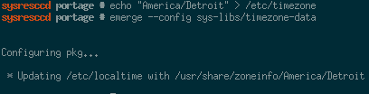
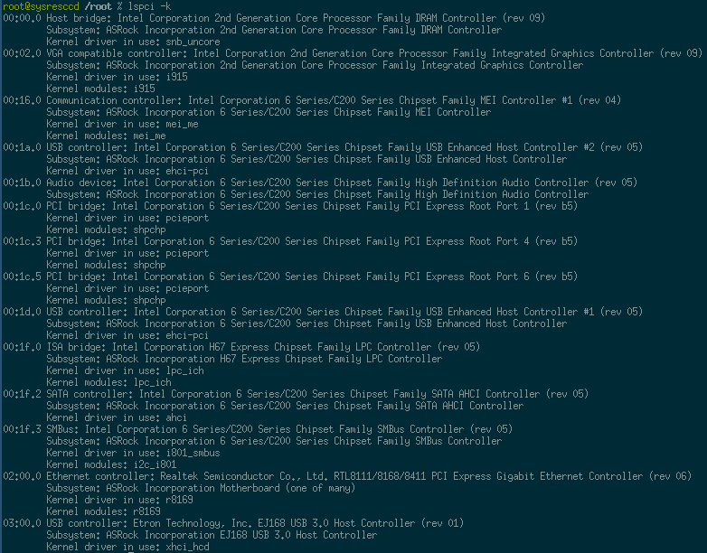
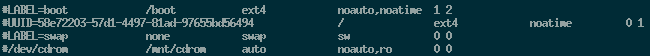
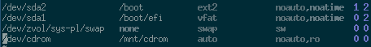
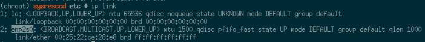
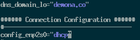
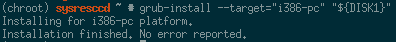

# Storage Preparation

Useful Definitions
```bash
DISK1="/dev/sda"
POOL="sys-pl"
```

## Partitioning

1. Create the partition table on the primary hard disk. Note that it should be optimally aligned. Also, switch to mebibytes.

    ```bash
    parted -a optimal "${DISK1}"
    unit mib
    mklabel gpt
    ```
2. From within parted create a 500 MiB file system for Grub's EFI implementation. Parted `set boot on` flags the partition for EFI system use.

    ```bash
    mkpart primary 1 3
    name 1 grub-0
    set 1 bios_grub on
    ```

3. Create partitions for Kernel files and leave the remainder for root.

    ```bash
    mkpart primary 3 629
    name 2 boot

    mkpart primary 131 -1
    name 3 root
    ```

## File System Setup

1. The kernel file system is primarily read-only so we may as well use ext2.

    ```bash
    mkfs.ext2 -T small "${DISK1}2"
    ```

2. Create the base file system.

    ```bash
    zpool create -o ashift=12 -o autoexpand=on -o feature@lz4_compress=enabled \
        -o cachefile=/tmp/zpool.cache \
        -O normalization=formD -m none -R /mnt/gentoo "${POOL}" \
        /dev/disk/by-partuuid/b014a733-51c7-4cb4-bdd1-baeb72522251
    ```

3. Create the file systems necessary for gentoo.

    ```bash
    #Swap
    zfs create "${POOL}/swap" -V 8G -b 4K
    mkswap "/dev/${POOL}/swap"

    # Root
    zfs create -o mountpoint=none ${POOL}/ROOT
    zfs create -o mountpoint=/ -o compression=lz4 ${POOL}/ROOT/gentoo

    # home
    zfs create -o mountpoint=/home -o compression=lz4 ${POOL}/HOME

    # portage
    zfs create -o mountpoint=none ${POOL}/GENTOO
    zfs create -o mountpoint=/usr/portage -o compression=lz4 ${POOL}/GENTOO/portage
    zfs create -o mountpoint=/usr/portage/distfiles ${POOL}/GENTOO/distfiles

    mkdir /boot
    mount "${DISK1}2" /boot
    mkdir -p /boot/efi
    mount "${DISK1}1" /boot/efi

    # portage (build)
    # Extra settings like sync off & compression
    zfs create -o mountpoint=/var/tmp/portage -o compression=lz4 -o sync=disabled ${POOL}/GENTOO/build-dir

    # packages
    zfs create -o mountpoint=/usr/portage/packages ${POOL}/GENTOO/packages

    # ccache directory
    zfs create -o mountpoint=/var/tmp/ccache -o compression=lz4 ${POOL}/GENTOO/ccache
    ```

4. Turn on the swap file system.

    ```bash
    swapon "/dev/${POOL}/swap"
    ```

# System Configuration 

## Collect Sources 

See the [gentoo handbook](https://wiki.gentoo.org/wiki/Handbook:AMD64/Installation/Stage) for further detail.

1. Go to the mount point

    ```bash
    cd /mnt/gentoo
    ```

2. Download the latest sources from somewhere

    ```bash
    wget http://mirrors.lug.mtu.edu/gentoo/releases/amd64/autobuilds/current-stage3-amd64/stage3-amd64-20170413.tar.bz2
    wget http://mirrors.lug.mtu.edu/gentoo/releases/amd64/autobuilds/current-stage3-amd64/stage3-amd64-20170413.tar.bz2.DIGESTS
    ```
3. Now that we have the sources, check them out for corruption

    ```bash
    grep --color $(openssl dgst -r -sha512 stage3-amd64-*.tar.bz2 | awk '{print $1}') \
        stage3-amd64-*.tar.bz2.DIGESTS
    ```
4. Extract the tarball in place.

    ```bash
    tar xvjpf stage3-*.tar.bz2 --xattrs --numeric-owner
    ```

## Change Root

1. Copy over our resolv.conf file to ensure DNS resolution continues to operate.

    ```bash
    cp -L /etc/resolv.conf etc/
    ```

2. Link pseudo file systems.

    ```bash
    mount -t proc proc /mnt/gentoo/proc
    mount --rbind /dev /mnt/gentoo/dev
    mount --rbind /sys /mnt/gentoo/sys
    ```

3. Actually change over to the local root environment.

    ```bash
    chroot /mnt/gentoo /bin/bash
    env-update; source /etc/profile; export PS1="(chroot) $PS1"; cd
    ```

4. Ensure you mount boot partitions.

    ```bash
    DISK1="/dev/sda"
    mkdir /boot
    mount "${DISK1}2" /boot
    mkdir -p /boot/efi
    mount "${DISK1}1" /boot/efi
    ```

## Configure portage

1. Copy in a good make.conf file to start probably from another machine.

    ```bash
    scp make.conf /mnt/gentoo/tmp/
    ```
2. Install the new makefile from within the system.

    ```bash 
    mv /tmp/make.conf /etc/portage/
    ```
3. Create the repos file for the base system.

    ```bash
    mkdir -p /etc/portage/repos.conf
    cp /usr/share/portage/config/repos.conf \
        /etc/portage/repos.conf/gentoo.conf
    ```
    *Note that we'll switch to git later*

4. Perform an initial pull and synchronization.

    ```bash
    emerge-webrsync
    emerge --sync
    ```
5. Select the desktop profile, make sure the number is the same
    
    ```bash
    eselect profile list
    eselect profile set 3
    ```
    [Selecting the right profile](img/install-select-profile.png)
6. Now we need to determine the right CPU flags:

    ```bash
    emerge -1v app-portage/cpuid2cpuflags
    cpuinfo2cpuflags-x86
    ```

7. With those changes in place remerge with the update configuration fileconfig.

    ```bash
    emerge -avtuDN world
    ```

8. Clear out eselect news.

    ```bash
    eselect news read
    eselect news purge
    ```

9. Collect some good mirrors and add the updated record to make.conf.

    ```bash
    emerge -1av mirrorselect
    mirrorselect -D -s4 -b10 -o >> /tmp/mirrors
    ```

10. Copy in the sets files from the repo - they're handy.

    ```bash
    cd ~
    mkdir .ssh
    chmod 700 .ssh
    ssh-keygen
    mkdir ~/repo
    cd ~/repo
    git clone git@github.com:pdemonaco/gentoo-notes.git
    mkdir /etc/portage/sets/
    cp /root/repo/gentoo-notes/setup/portage/system/etc/portage/sets/* \
        /etc/portage/sets/
    ```
11. Install all of the packages referenced in the sets

    ```bash
    for SET in $(ls /etc/portage/sets)
    do
        emerge -avtuDNn "@${SET}"
    done
    ```

### Git based Portage 

Switch to git-based portage tree for gentoo.
    
1. Make sure a repo config exists, note that you'll probably have to do this earlier in the setup process.

    ```bash
    mkdir etc/portage/repos.conf
    cp usr/share/portage/config/repos.conf etc/portage/repos.conf/gentoo.conf
    ```

2. Modify the new gentoo.conf to reflect this change

    ```ini
    [DEFAULT]
    main-repo = gentoo

    [gentoo]
    location = /usr/portage
    sync-type = git
    sync-uri = https://github.com/gentoo-mirror/gentoo.git
    auto-sync = yes
    ```

3. Unmount the distfiles and packages file systems. If you're still in the chrooted environment do this from outside.

    ```bash
    zfs umount "${POOL}/GENTOO/distfiles"
    zfs umount "${POOL}/GENTOO/packages"
    ```
4. Clear out the existing portage tree.

    ```bash
    cd /usr/portage
    rm -r ./*
    emerge --sync
    ```
5. Remount the two file systems which were previously unmounted.

    ```bash
    zfs mount "${POOL}/GENTOO/distfiles"
    zfs mount "${POOL}/GENTOO/packages"
    ```

## Base configuration

Definitely mix in steps from chapters 5-6 of the handbook here. 

### VIM Setup

1. Install vim - don't be a savage, nano is gross

    ```bash
    emerge -avtn app-editors/vim
    ```
2. Once we have vim we need it to be the default editor for our system.

    ```bash
    eselect editor list
    eselect editor set 3
    ```
    


### Git Tracking for /etc

1. Basic git tracking for etc.

    ```bash
    cd /etc
    git init
    git config --global user.email "you@example.com"
    git config --global user.name "Your Name"
    ```

### Timezone Data

1. EST for this server.

    ```bash
    echo "America/Detroit" > /etc/timezone
    emerge --config sys-libs/timezone-data
    ```
    
2. Adding to git.

    ```bash
    cd /etc/
    git add timezone
    ```

### Locale

1. Prep the locale list

    ```bash
    git add /etc/locale.gen
    vim /etc/locale.gen
    locale-gen
    eselect locale list
    ```

2. Choose the locale you want to be the primary.

    

    ```bash
    eselect locale set 4
    source /etc/profile
    ```

## Kernel

1. Emerge the standard gentoo sources. Hardened would be nice, but it's problematic for desktop use.

    ```bash
    emerge -v sys-kernel/gentoo-sources
    KERNEL_VERSION="4.9.16-gentoo"
    ```

2. With the source in place we need a starting point. Copy in the default x86 configuration and run the "silent" configuration updater.

    ```bash
    cd /usr/src/linux
    cp arch/x86/configs/x86_64_defconfig .config
    make defconfig
    ```
3. Emerge the hardware and shell utilities assuming you added the sets in the portal part.

    ```bash
    emerge -avt @tools-hw
    emerge -avt @tools-shell
    ```

Interesting settings:

Kernel Flag | Description | Link
------------|-------------|-----
CONFIG_KERNEL_XZ | Use the LZMA2 compression algorithm | N/A
CONFIG_IKCONFIG | Allow access to .config through proc | N/A
SCHED_AUTOGROUP | Automatic process group scheduling | http://www.usenix.org.uk/content/CONFIG_SCHED_AUTOGROUP.html
CC_STACKPROTECTOR_STRONG | Strong stack overflow protection | http://cateee.net/lkddb/web-lkddb/CC_STACKPROTECTOR_STRONG.html
X86_INTEL_LPSS | Low power subsystem support? | N/A
MCORE2 | Processor family | 
PREEMPT_VOLUNTARY | Preemption Model - possibly consider PREEMPT | N/A
CONFIG_TRANSPARENT_HUGEPAG | Allow huge-pages to be used transparently to applications | N/A
CLEANCACHE | Essentially an eviction zone, could be interesting | N/A
FRONTSWAP | More trancendent memory stuff - interesting | N/A
HZ_1000 | Highest possible timer frequency - we need the speed | N/A
LEGACY_VSYSCALL_NONE | Investigate possible removal of legacy calls | N/A
CPU_FREQ_DEFAULT_GOV_USERSPACE | Might need some handling for CPU freq | N/A
X86_INTEL_PSTATE | Probably needed for this one | N/A
CONFIG_NET_IPIP | Read more about this? Could be interesting for wireless roaming | N/A

Also, potentially add a bunch of different cipher and compression algorithms. I added everything.

### MCE Log

Ensure that the appropriate MCE features are present. Also the following 
application is required:

```bash
emerge -av app-admin/mcelog
```

### Physical Device Configuration

1. List the currently visible PCI devices and print their kernel modules. This should probably be done from outside the chroot environment.

    ```bash
    lspci -k
    ```
    
2. Open the kernel configuration tool.

    ```bash
    cd /usr/src/linux
    make menuconfig
    ```
3. This system utilizes the following kernel drivers:

    Device Name | Module Name | Kernel Flag | Description 
    -------------|-------------|-------------|-------------
    Ethernet controller: Realtek Semiconductor Co., Ltd. RTL8111/8168/8411 PCI Express Gigabit Ethernet Controller (rev 06) | r8169 | CONFIG_8169 | Gigabit Ethernet
    SMBus: Intel Corporation 6 Series/C200 Series Chipset Family SMBus Controller (rev 05) | i2c_i801 | CONFIG_I2C_I801 | Provides i2c support for Intel's sensors and other stuff
    ISA bridge: Intel Corporation H67 Express Chipset Family LPC Controller (rev 05) | lpc_ich  | CONFIG_LPC_ICH | Needed for the LPC Controller - talks to old school devices.
    Audio device: Intel Corporation 6 Series/C200 Series Chipset Family High Definition Audio Controller (rev 05) | snd-hda-intel | CONFIG_SND_HDA_INTEL | Intel HD Audio (Azalia) 
    PCI bridge: Intel Corporation 6 Series/C200 Series Chipset Family PCI Express Root Port 1 (rev b5) | shpchp | CONFIG_HOTPLUG_PCI_SHPC | PCI Hotplug
    SATA controller Intel Corporation Device a102 | ahci | CONFIG_SATA_AHCI | Intel SATA AHCI Controller
    Communication controller: Intel Corporation 6 Series/C200 Series Chipset Family MEI Controller #1 (rev 04) | mei_me | CONFIG_INTEL_MEI_ME | Intel Management Engine
    USB controller: Etron Technology, Inc. EJ168 USB 3.0 Host Controller (rev 01) | xhci-hcd | CONFIG_USB_XHCI_HCD | USB 3.0 Driver
    VGA compatible controller: Intel Corporation 2nd Generation Core Processor Family Integrated Graphics Controller (rev 09) | i915 | CONFIG_DRM_I915 | Integrated Graphics
    Host bridge: Intel Corporation 2nd Generation Core Processor Family DRAM Controller (rev 09) | snb_uncore | PERF_EVENTS_INTEL_UNCORE | Already set, uncore performance counters

### Intel HD Graphics

1. Ensure sys-kernel/linux-firmware is installed.

    ```bash
    emerge -avtn sys-kernel/linux-firmware
    ```
2. Use the following command to determine which firmware file is needed:

    ```bash
    grep -B 3 'MODULE_FIRMWARE.*SKL' drivers/gpu/drm/i915/intel_guc_loader.c \
        drivers/gpu/drm/i915/intel_csr.c
    ```
3. Set the following kernel flags.
    
    ```bash
    CONFIG_AGP=y
    CONFIG_AGP_INTEL=y
    CONFIG_DRM=y
    CONFIG_DRM_FBDEV_EMULATION=y
    CONFIG_DRM_I915=y
    CONFIG_EXTRA_FIRMWARE=i915/skl_dmc_ver1.bin
    CONFIG_EXTRA_FIRMWARE_DIR=/lib/firmware
    ```
4. Update make.conf with the appropriate video cards settings.

    ```bash
    VIDEO_CARDS="intel i965"
    ```

Further details can be found [here](https://wiki.gentoo.org/wiki/Intel).

### Sound settings

More detail to follow here. This is something though:

CONFIG_SND_HDA_PREALLOC_SIZE - set to 2048


### Setup kernel module load

1. Edit `/etc/conf.d/modules` and add a space separated list of the appropriate values

    ```bash
    cd /etc/
    vim conf.d/modules
    ```
2. Add the relevant modules to the list

    ```bash
    modules="mei_me r8169"
    ```
3. Store this in our local git repo

    ```bash
    git add conf.d/modules
    git commit -m 'Autoloaded Module Settings'
    ```

### Compile

1. Install the latest firmware.

    ```bash
    cd /etc
    mkdir -p portage/package.accept_keywords
    echo "sys-kernel/linux-firmware ~amd64" >> portage/package.accept_keywords/firmware
    git add portage/package.accept_keywords/firmware
    git commit -m 'Ensure we always have the latest firmware'
    emerge -v sys-kernel/linux-firmware
    ```
2. Now we need to do our initial compilation.

    ```bash
    KERNEL_VERSION="4.9.16-gentoo"
    cd /usr/src/linux
    mount "${DISK1}2" /boot
    make -j5 && make -j5 modules_install
    cp "arch/x86_64/boot/bzImage" "/boot/kernel-${KERNEL_VERSION}-00"
    mkdir -p /etc/kernels
    cp .config "/etc/kernels/kernel-config-${KERNEL_VERSION}-00"
    cd /etc/
    git add "/etc/kernels/kernel-config-${KERNEL_VERSION}-00"
    git commit -m 'Kernel configuration'
    ```

## File system requirements

### ZFS Installation

1. First we'll need to add some keywords to portage to allow installation of the module.

    ```bash
    cd /etc
    echo "sys-fs/zfs-kmod ~amd64" >> portage/package.accept_keywords/zfs
    echo "sys-kernel/spl ~amd64" >> portage/package.accept_keywords/zfs
    echo "sys-fs/zfs ~amd64" >> portage/package.accept_keywords/zfs
    git add portage/package.accept_keywords/zfs
    git commit -m 'ZFS support'
    ```

2. With these in place we can safely emerge zfs.

    ```bash
    emerge -v zfs
    ```

3. Once the modules are present we'll need to add them to appropriate runlevels in OpenRC.

    ```bash
    rc-update add zfs-zed boot
    rc-update add zfs-import boot
    rc-update add zfs-mount boot
    rc-update add zfs-share default
    ```

## System Configuration

Finalization steps prior to being able to reboot into the new environment.

### fstab

1. While most of the involved file systems will be automatically mounted by ZFS we do need to specify the boot and swap mount points in [fstab](https://wiki.gentoo.org/wiki/Handbook:AMD64/Installation/System#Filesystem_information).

    ```bash
    cd /etc/
    git add fstab
    git commit -m 'Blank fstab'
    vim fstab
    ```
    Unmodified configuration
    

2. In this case the following file systems needed modification

    Mountpoint | Device | File System |Description
    -----------|--------|-------------|------------
    /boot | /dev/sda2 | ext2 | Base boot partition
    /boot/efi | /dev/sda1 | vfat | GRUB EFI partition as we're doing EFI boot
    none | /dev/zvol/sys-pl/swap | swap | Our swap block device needs notation here
    /dev/cdrom | /mnt/cdrom | auto | We do have a cdrom in this machine

    

3. Once the changes are in place, ensure that fstab is added to git.

    ```bash
    git add fstab
    git commit -m 'fstab configured'
    ```

### Networking

#### Host and Domain Names

1. Set the hostname we'll have after the first boot.

    ```bash
    cd /etc
    vim conf.d/hostname
    git add conf.d/hostname
    ```

2. Also store full hostnames in case DNS is down

    ```bash
    cd /etc
    vim hosts
    git add hosts
    ```

3. While it'll only be used temporarily before getting blown out by NetowrkManager we can go ahead and set a domain name as well.

    ```bash
    cd /etc
    echo 'dns_domain_lo="mynetwork"' > conf.d/net
    git add conf.d/net
    git commit -m 'Basic hostname & hosts entries'
    ```

#### Temporary Network Config

Installing network manager before the first boot is too much of a hassle so we need to set up a simple config with netifrc.

1. First determine the adapter name via `ip link`

    

2. With the name determined, create a new symlink from the lo script to the adapter and add it to the default run-level.

    ```bash
    ADAPTER="enp2s0"
    cd /etc/init.d/
    ln -s net.lo "net.${ADAPTER}"
    git add "net.${ADAPTER}"
    rc-update add "net.${ADAPTER}"
    ```

3. Then add the appropriate lines to /etc/conf.d/net

    ```bash
    cd /etc/conf.d
    vim net
    git add net
    git commit -m 'Temporary network config'
    ```

    

### Initial Setup

#### Root Password

Don't forget to set it via `passwd`.

#### Keymap

If you want a different keymap in the console set it in /etc/conf.d/keymaps

#### Time-Zone

Assuming the hardware clock is in UTC there's nothing to change here. Definitely double check in the UEFI interface to ensure we are running UTC before the first boot.

#### Logging

1. Install metalog for the moment because its fancy, quick, and easy to setup

    ```bash
    emerge -vt app-admin/metalog
    eselect rc add metalog default
    git add /etc/metalog.conf
    cd /etc
    git commit -m 'System logger'
    ```

#### SSH Daemon

1. Add the SSH daemon to the default runlevel.

    ```bash
    eselect rc add sshd default
    ```

#### Cron

1. We'll also need to get a cron going so we can schedule automatic zfs snapshots, git updates, and other fun stuff.

    ```bash
    emerge -vt sys-process/fcron
    eselect rc add fcron default
    crontab /etc/crontab
    ```

#### Local User

Definitely a must have for any system. We'll need to create ourself, and add 
to the appropriate groups.

```bash
USER="phil"
NEW_GROUPS="audio,video,usb,users,wheel,cdrom,plugdev"
useradd -m -G "${NEW_GROUPS}" -s /bin/zsh "${USER}"
passwd "${USER}"
```

#### Sudo

Uncomment the "wheel" rule

```bash
visudo
cd /etc
git add /etc/sudoers
```

## Boot Config

### Initramfs

We're going to be using dracut as it has better udev support during boot
than genkernel as of this writing.

1. First install the application.

    ```bash
    echo "sys-kernel/dracut ~amd64" >> /etc/portage/package.accept_keywords/dracut
    cd /etc/
    git add portage/package.accept_keywords/dracut
    emerge -av sys-kernel/dracut
    ```
2. Add support for zfs and usb drivers.

    ```bash
    cd /etc
    echo "#additional kernel modules to the default" >> /etc/dracut.conf.d/drivers.conf
    echo 'add_drivers+="hid_generic zfs spl"' >> /etc/dracut.conf.d/drivers.conf
    git add dracut.conf.d/drivers.conf
    ```
3. Ensure dracut is built to the specifications to this local machine.

    ```bash
    echo '# build initrd only to boot current hardware' >> /etc/dracut.conf.d/hostonly.conf
    echo 'hostonly="yes"' >> /etc/dracut.conf.d/hostonly.conf
    git add /etc/dracut.conf.d/hostonly.conf
    ```
4. Remove unnecessary modules from the included set and add zfs.

    ```bash
    echo '# Exact list of dracut modules to use.  Modules not listed here are not going
          # to be included.  If you only want to add some optional modules use
          # add_dracutmodules option instead.
          #dracutmodules+=""

          # dracut modules to omit
          omit_dracutmodules+="btrfs dmraid iscsi multipath nbd nfs resume"

          # dracut modules to add to the default
          add_dracutmodules+="zfs"' >> /etc/dracut.conf.d/modules.conf
    git add /etc/dracut.conf.d/modules.conf
    git commit -m 'Dracut Settings'
    ```

5. With this config in place we can go ahead and generate our config

    ```bash
    cd /boot
    dracut --xz --kver ${KERNEL_VERSION} -H
    mv initramfs-${KERNEL_VERSION}.img initramfs-${KERNEL_VERSION}-00.img
    ```

### Bootloader

1. Install GRUB2 along with all necessary ZFS flags.

    ```bash
    cd /etc
    echo "sys-boot/grub:2 ~amd64" >> portage/package.accept_keywords/zfs
    echo "sys-boot/grub:2 libzfs" >> portage/package.use/zfs
    git add portage/package.use/zfs
    git add portage/package.accept_keywords/zfs
    emerge -av sys-boot/grub:2
    ```

2. Then we'll need to update grub with some sane defaults.

    ```bash
    cd /etc
    sed -i 's/^#GRUB_CMDLINE_LINUX_DEFAULT=""/GRUB_CMDLINE_LINUX_DEFAULT="snd-hda-intel.index=1,0 zfs_force=1 vconsole.keymap=dvorak"/' default/grub 
    git add default/grub
    git commit
    ```

3. Apply the grub directly to the hard disk.

    ```bash
    grub-install --target="i386-pc" "${DISK1}"
    ```

    

4. Generate the grub config.

    ```bash
    cd /boot
    grub-mkconfig -o grub/grub.cfg
    ```

## Exit the Install Environment

1. Unmount the locally mounted file systems.

    ```bash
    umount /boot
    ```
2. Leave the chroot environment via `exit`
3. Unmount virtual file systems.

    ```bash
    umount -l /mnt/gentoo/proc /mnt/gentoo/dev /mnt/gentoo/sys
    ```

4. Unmount the standard file systems.

    ```bash
    POOL="sys-pl"
    zpool export "${POOL}" 
    ```
5. Reboot the system via `reboot`
