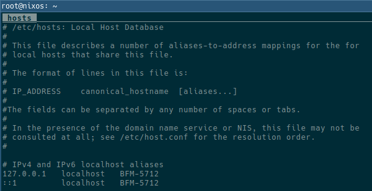
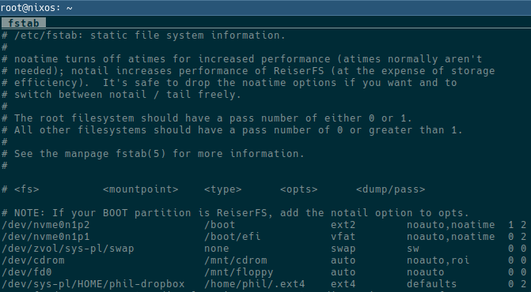
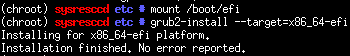

# File Systems

Useful Definitions
```bash
DISK1="/dev/nvme0n1"
POOL="sys-pl"
```

## Partitioning

1. Create the partition table on the primary hard disk. Note that it should be optimally aligned. Also, switch to mebibytes.

    ```bash
    parted -a optimal "${DISK1}"
    unit mib
    mklabel gpt
    ```
1. From within parted create a 500 MiB file system for Grub's EFI implementation. 

    ```bash
    mkpart primary 1 501
    name 1 efi
    set 1 boot on
    ```
1. Create partitions for Kernel files and leave the remainder for root.

    ```bash
    mkpart primary 501 629
    name 2 boot

    mkpart primary 629 -1
    name 3 root
    ```

## Formatting

1. Specific components of the system require certain file system types. In particular, the EFI System Partition must be FAT32.

    ```bash
    mkdosfs -F 32 -n EFI "${DISK1}p1"
    ```
1. The kernel file system is primarily read-only so we may as well use ext2.

    ```bash
    mkfs.ext2 -T small "${DISK1}p2"
    ```

## Crypto

1. Create and open the crypto vault

    ```bash
    cryptsetup -c aes-xts-plain64 -s 512 luksFormat "${DISK1}p3"
    ```
1. Are you sure you want to overwrite? YES
1. Enter your passphrase
1. Open the encrypted volume

    ```bash
    cryptsetup luksOpen "${DISK1}p"3 "${POOL}-crypt0"
    ```

See Also:
* [Encrypted Mirrored ZFS Root](https://thestaticvoid.com/post/2013/10/26/how-i-do-encrypted-mirrored-zfs-root-on-linux/)
* [DM-Crypt_LUKS](https://wiki.gentoo.org/wiki/DM-Crypt_LUKS)

## ZFS File Systems

1. Create the base file-system. Eventually this should be mirrored, but whatever.

    ```bash
    zpool create -o ashift=12 -o autoexpand=on -o feature@lz4_compress=enabled \
        -o cachefile=/tmp/zpool.cache \
        -O normalization=formD -m none -R /mnt/gentoo "${POOL}" \
        "${POOL}-crypt0"
    ```

### Replicate via send / receive

1. Create a migration snapshot on the source system

    ```bash
    POOL="sys-pl"
    SNAP_NAME="migration-$(date +%Y-%m-%d)"
    zfs snap -r "${POOL}@${SNAP_NAME}"
    ```
1. Transfer the files over bois

    ```bash
    TARGET="nixos@172.24.132.251"
    zfs send -R "${POOL}@${SNAP_NAME}" | ssh "${TARGET}" "sudo zfs recv -F ${POOL}"
    ```
1. Mount the zfs volumes

    ```bash
    zfs mount -a
    ```

# Configuration

Note that this all assumes we're migrating via zfs send as described above.

## Change Root

1. Turn on Swap

    ```bash
    swapon "/dev/${POOL}/swap"
    ```
1. Copy `/etc/resolv.conf` over to the chroot

    ```bash
    cp -L /etc/resolv.conf /mnt/gentoo/etc/
    ```
1. Link the pseudo file systems

    ```bash
    mount -t proc proc /mnt/gentoo/proc
    mount --rbind /dev /mnt/gentoo/dev
    mount --rbind /sys /mnt/gentoo/sys
    ```
1. Alternatively, use the swap script [here](../../../scripts/chroot.sh)
1. Actually switch over to the gentoo root.

    ```bash
    chroot /mnt/gentoo /bin/sh
    source /etc/profile; env-update; export PS1="(chroot) $PS1"; cd
    ```

## Configure portage

1. Copy in a good make.conf file to start. Once it's in place, pass in an additional set of parameters using the CPU flags utility

    ```bash
    emerge -1v app-portage/cpuid2cpuflags
    cpuid2cpuflags
    # Output like CPU_FLAGS_X86: aes avx avx2 f16c fma3 mmx mmxext pclmul popcnt sse sse2 sse3 sse4_1 sse4_2 ssse3
    ```

1. With those changes in place, sync an updated copy of the portage tree and emerge with current config.

    ```bash
    emerge --sync && emerge -1u sys-apps/portage && emerge -avtuDN world
    ```

## Tweak Modules & Dracut before finalizing the install

1. Get a list of the kernel modules

    ```bash
    lspci -k | grep "Kernel driver in use" | sort | uniq | awk -v FS=: '{print $2}'
    ```

    |module|
    |------|
    |amdgpu|
    |ccp|
    |ehci-pci|
    |iwlwifi|
    |k10temp|
    |nvme|
    |pcieport|
    |piix4_smbus|
    |r8169|
    |rtsx_pci|
    |serial|
    |snd_hda_intel|
    |snd_rn_pci_acp3x|
    |xhci_hcd|
1. Update `/etc/conf.d/modules` - this time I'm going to try only adding the vbox stuff
1. Update `/etc/dracut.conf.d/devices.conf` to have the correct root disk
1. Add any relevant kernel modules to `/etc/dracut.conf.d/drivers.conf`. So far

    ```bash
    add_drivers+="zfs dm_crypt nvme"
    ```

## Finalization

1. Set the hostname in both `/etc/conf.d/hostname` and `/etc/hosts`.

    ```bash
    cd /etc
    vim /etc/conf.d/hostname
    git add /etc/conf.d/hostname

    vim /etc/hosts
    git add /etc/hosts
    ```
    
1. Regenerate host keys

    ```bash
    /usr/bin/ssh-keygen -t rsa -f /etc/ssh/ssh_host_rsa_key -N ""
    /usr/bin/ssh-keygen -t dsa -f /etc/ssh/ssh_host_dsa_key -N ""
    /usr/bin/ssh-keygen -t ed25519 -f /etc/ssh/ssh_host_ed25519_key -N ""
    ```

1. Update LUKS settings in `/etc/crypttab` so dracut gives it the right instructions

    ```bash
    sys-pl-crypt0   "/dev/${DISK1}p3"   none    luks
    ```
1. Correct the device names in `/etc/fstab` then commit. In this case the following file systems needed modification

    Mountpoint | Device | Description
    -----------|--------|------------
    /boot | /dev/sda2 | Base boot partition
    /boot/efi | /dev/sda1 | GRUB EFI partition as we're doing EFI boot
    / | - | Comment out root as ZFS is handling
    none | /dev/zvol/sys-pl/swap | Our swap block device needs notation here

    

    [Gentoo Documentation](https://wiki.gentoo.org/wiki/Handbook:AMD64/Installation/System#Filesystem_information)
1. Commit changes to the fstab

    ```bash
    cd /etc/
    git add fstab
    git commit -m 'Corrected fstab'
    ```

## Bootloader & Kernel

1. Mount the boot volume.

    ```bash
    mount /boot
    ```
1. Generate the latest kernel & install it.

    ```bash
    KERNEL_VERSION="5.4.55"
    emerge -avt @module-rebuild && dracut --xz \
      "/boot/initramfs-${KERNEL_VERSION}.img" \
      "${KERNEL_VERSION}" -force
    ```
1. Apply the grub directly to the hard disk.

    ```bash
    mount /boot/efi
    grub-install --target=x86_64-efi
    ```

    

1. Generate the grub config.

    ```bash
    grub-mkconfig -o /boot/grub/grub.cfg
    ```
1. Since grub is still fucky with ZFS we need to add the pool names.

    ```bash
    POOL="sys-pl"
    sed -i "s/ZFS=\//ZFS=${POOL}\//g" "/boot/grub/grub.cfg"
    ```

#### TODO - finish!


### Graphics

These links may not work in this first push.

* [AMDGPU](amdgpu.md)

## Exit the Install Environment

Unmount virtual file systems

```bash
umount -l /mnt/gentoo/proc /mnt/gentoo/dev /mnt/gentoo/sys
```

Unmount the standard file systems

```bash
umount /mnt/gentoo/boot
umount /mnt/gentoo
```
