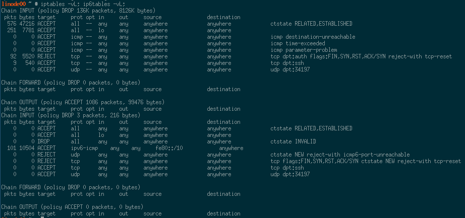

# Iptables

1. Copy over the initial firewall rule configuration file.
2. Execute the firewall rules and then print the current configuration `iptables -vL; ip6tables -vL;`. You should see something similar to the following:

    
3. Save the current rules for both iptables and ip6tables.

    ```bash
    rc-service iptables save
    rc-service ip6tables save
    ```
4. Start both services and add them to the `boot` runlevel.

    ```bash
    eselect rc start iptables
    eselect rc start ip6tables
    eselect rc add iptables boot
    eselect rc add ip6tables boot
    ```
# Fail2ban

1. Install `fail2ban` on the server.

    ```bash
    emerge -vt fail2ban app-admin/gamin
    ```
2. Create a config file for sshd.

    ```bash
    touch /etc/fail2ban/jail.d/sshd.conf
    ```
3. Start the fail2ban service and add it to the default runlevel.

    ```bash
    eselect rc start fail2ban
    eselect rc add fail2ban default
    ```
