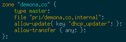

# Installation 

1. Emerge the dhcp package. We need a ntp, not necessarily this one.

    ```bash
    emerge -av net-misc/dhcp net-misc/ntp
    ```
2. Specify the correct listening interface(s) in `/etc/conf.d/dhcpd`. For example: `DHCPD_IFACE="eth1"`
3. Start the daemon and add it to the default run level.

    ```bash
    eselect rc start dhcpd
    eselect rc add dhcpd default
    ```

# Scope configuration


# Configure Dynamic Updates

1. Generate a key for DHCP to use to update DNS

    ```bash
    dnssec-keygen -a HMAC-SHA256 -b 256 -n USER dhcp_updater
    ```
2. Create a new file to store this HMAC key for both bind and the ISC DHCP server.

    ```bash
    touch /etc/bind/dhcp_updater.key
    chmod 640 /etc/bind/dhcp_updater.key
    chown root:named /etc/bind/dhcp_updater.key
    ```
3. Copy the key from step 2 into dhcp_updater.key with the following format.

    ```bash
    key "dns_updater" {
      algorithm HMAC-SHA256;
      secret  <secret>;
    };
    ```
4. Add a statement to `/etc/dhcp/dhcpd.conf`.

    ```bash
    include "/etc/bind/dhcp_updater.key";
    ```
5. This key must also be included in `/etc/bind/named.conf`.

    ```bash
    include "/etc/bind/dhcp_updater.key";
    ```
6. Update each zone which should allow updates from the DHCP server with the following rule set in `named.conf`.

    ```bash
    allow-update{ key "dhcp_updater"; };
    ```
    


# Configure OpenVPN Dynamic Updates

Based on this [guide] largely. 

1. Install the perl module via cpan.

    ```bash
    cpan Net::OpenVPN::DDNS
    ```
2. Generate a new DNSSEC updater key on the server.

    ```bash
    dnssec-keygen -a HMAC-SHA256 -b 256 -n USER pfsense
    cp Kpfsense*.key /tmp/
    chmod 644 /tmp/ Kpfsense.*.key
    ```
3. Update the local `named.conf` adding the new pfsense key to the allowed update statements and create the appropriate key file to include.
4. Log into the pfsense server via ssh and scp the key to `/etc/openvpn/ddns/keys` and rename the file to match the name of the zone.

    ```bash
    scp <user>@<dns-server>:/tmp/Kpfsense.<key-stuff>.key /etc/openvpn/ddns/keys/<zone-name>
    chmod 440 /etc/openvpn/ddns/keys/<zone-name>
    ```
