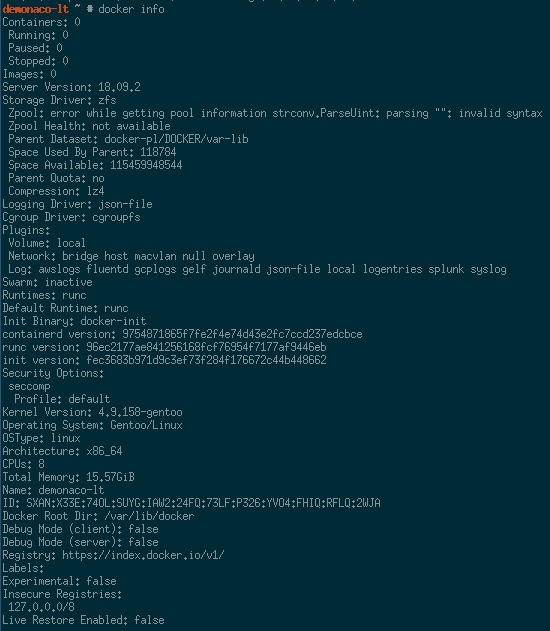

## Installation Prep

1. Install the docker package.

    ```bash
    emerge -avt app-emulation/docker
    ```
1. Check that the relevant kernel flags are enabled by running the following script.

    ```bash
    /usr/share/docker/contrib/check-config.sh
    ```
1. Add all the relevant settings to kernel config and recompile.

## Storage Backend ZFS

1. Find a suitable block device and format it.

    ```bash
    DISK=/dev/sdb

    sudo parted -a optimal "${DISK}"
    unit mib
    mklabel gpt
    mkpart docker-pool 1 -1
    ```
1. Create the zpool on that new disk

    ```bash
    POOL_NAME="docker-pl"
    DISK="/dev/disk/by-partlabel/docker-pool"
    zpool create -f -o ashift=12 -o autoexpand=on \
      -o feature@lz4_compress=enabled \
      -O normalization=formD \
      -m none "${POOL_NAME}" \
      "${DISK}"
    ```
1. Backup the current contents of `/var/lib/docker` if they exist.

    ```bash
    tar -cvf /tmp/docker-var.tar /var/lib/docker
    ```
1. Create the requisite mountpoints via ZFS.

    ```bash
    zfs create -o mountpoint=none "${POOL_NAME}/DOCKER"
    zfs create -o compression=lz4 -o mountpoint=/var/lib/docker "${POOL_NAME}/DOCKER/var-lib"
    ```

### Service for OpenRC

1. Edit `/etc/conf.d/docker` and add the following

    ```bash
    # Configure ZFS as the storage driver and set the root to /var/lib/docker
    DOCKER_OPTS="--storage-driver zfs --graph /var/lib/docker"
    ```
2. Start the docker service.

    ```bash
    eselect rc start docker
    ```
3. Check and see how things are with `docker info`. Right now there's some shitty bug with parsing the output of zpool status.

    

## See Also

* [Gentoo Docker Setup](https://wiki.gentoo.org/wiki/Docker)
* [Docker ZFS Storage Driver](https://docs.docker.com/storage/storagedriver/zfs-driver/)
