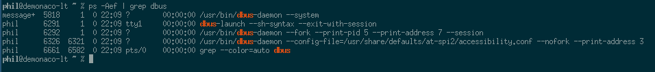

# Installation

1. Make sure the kernel settings are established as described by the [gentoo setup article](https://wiki.gentoo.org/wiki/NetworkManager#Kernel).

    ```bash
    cd /etc
    echo "net-misc/networkmanager ~amd64" >> /etc/portage/package.accept_keywords/networkmanager
    git add /etc/portage/package.accept_keywords/networkmanager
    echo "net-misc/networkmanager resolvconf" >> /etc/portage/package.use/networkmanager
    echo "app-crypt/pinentry gnome-keyring" >> /etc/portage/package.use/networkmanager
    git add /etc/portage/package.use/networkmanager
    ```

2. Add yourself to plugdev so that network changes can be made without becoming superuser.

    ```bash
    usermod -a -G plugdev phil
    ```

3. Install network manager 

    ```bash
    emerge -avtn net-misc/networkmanager gnome-extra/nm-applet
    ```

4. Remove any existing network interface from current run levels and add network manager.

    ```bash
    for LEVEL in $( eselect rc list | awk '$0 ~ "^  [[:alpha:]]+" \
        { if( $2 ~ "[[:alpha:]]+") print $2; }' | sort | uniq )
    do
        for SERVICE in $(eselect rc show "${LEVEL}" \
            | awk '/^  net\./ {print $1}')
        do
            eselect rc delete "${SERVICE}" "${LEVEL}"
        done
    done
    eselect rc start NetworkManager
    eselect rc add NetworkManager default
    ```

5. Add the following line to `/etc/dhcp/dhclient.conf` so that you actually 
transmit a hostname when registering a DHCP address. 

    ```bash
    HOSTNAME=$(hostname)
    cd /etc
    echo "send host-name \"${HOSTNAME}\";" >> /etc/dhcp/dhclient.conf
    git add /etc/dhcp/dhclient.conf
    ```
    *Note that this must be your hostname as a text representation. Sub-shells are not evaluated here*

# Dbus

## Privileges 

Assuming you have a working install you're probably going to need to include the dbus config settings described in the [gentoo article](https://wiki.gentoo.org/wiki/NetworkManager#Fixing_nm-applet_insufficient_privileges). 

Here's the code I needed to add:

1. Create the following file to contain the rules.

    ```bash
    touch /etc/polkit-1/rules.d/50-org.freedesktop.NetworkManager.rules
    ```
2. Populate it with the appropriate configuration data.
    
    ```bash
    echo 'polkit.addRule(function(action, subject) {
        if (action.id.indexOf("org.freedesktop.NetworkManager.") == 0 && subject.isInGroup("plugdev")) {
            return polkit.Result.YES;
        }
    });' > /etc/polkit-1/rules.d/50-org.freedesktop.NetworkManager.rules
    ```
3. Add it to your git repo if you have one for etc.

    ```bash
    cd /etc/
    git add /etc/polkit-1/rules.d/50-org.freedesktop.NetworkManager.rules
    ```

# Launch

Make sure to do this __before__ any other processes which depend on dbus are launched. gnome-keyring for example.

Ensure the process which starts your X environment doesn't leave you with multiple instances of dbus. This [article](http://www.nurdletech.com/linux-notes/agents/keyring.html) does a good job of explaining what you need to do at a high level.

1. Start dbus only once per session using the following check.

    ```bash
    if [[ -z "${DBUS_SESSION_BUS_ADDRESS}" ]];
    then
        eval $(dbus-launch --sh-syntax --exit-with-session)
    fi
    ```
2. Verify that only one is running. Checking processes should yield something like the following.

    

# Anyconnect VPN support

Ensure Kernel support for `CONFIG_TUN` is present

