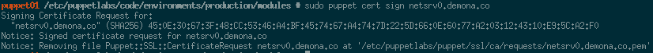

# New Agent 

1. Unmask the current version of puppet-agent.

    ```bash
    cd /etc
    echo "app-admin/puppet-agent ~amd64" > /etc/portage/package.accept_keywords/puppet
    git add /etc/portage/package.accept_keywords/puppet
    echo "app-admin/puppet-agent puppetdb" > /etc/portage/package.use/puppet
    git add /etc/portage/package.use/puppet
    cd -
    ```
2. Install the agent package.
    
    ```bash
    emerge -avtn puppet-agent
    ```
3. Add it to the default run-level and start it up.

    ```bash
    eselect rc start puppet
    eselect rc add puppet default
    ```

# Puppet Server (Master)

1. Check for new certificate requests

    ```bash
    sudo /opt/puppetlabs/bin/puppet cert list
    ```
    
2. Assuming the new machine is in this list, sign it's cert.

    ```bash
    sudo puppet cert sign netsrv0.demona.co
    ```
    
