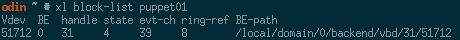
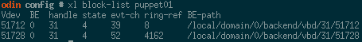
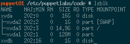

Simple set of instructions to add a disk to a domU.

1. Create a new zVOL for this desired disk. 

    ```bash
    SIZE="1g"
    DOMAIN=puppet01
    NAME="xen-pl/XEN/vdisk/${DOMAIN}-config"
    zfs create -V "${SIZE}" "${NAME}"
    ```
1. List the currently attached block devices and find the next available letter.

    ```bash
    xl block-list "${DOMAIN}"
    # If there's only one device, we probably need to do xvdb
    ```
1. Modify the existing domain via `xl` to attach the new block device.

    ```bash
    VDEV_LETTER='b'
    DISK_STRING="format=raw, vdev=xvd${VDEV_LETTER}, access=w, target=/dev/zvol/${NAME}"
    xl block-attach "${DOMAIN}" "${DISK_STRING}"
    ```
    
    
1. At this point the new device should be visible from within the guest.

    
1. Update the guest's config file to ensure the new disk is mounted at boot. It should be added to the end of disk list

    ```bash
    cd /etc/xen/config/
    vim "${DOMAIN}.pv"
    git add "${DOMAIN}.pv"
    ```
