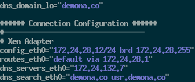

## Preparation

First, decide on the name of the new domu

```bash
SOURCE_DOMU=gentoo-ext4
DOMU=new-domu
```

### Clone Standard DomU

1. Create a snapshot of the standard DomU

    ```bash
    zfs snap xen-pl/XEN/vdisk/${SOURCE_DOMU}@pre-clone
    zfs send xen-pl/XEN/vdisk/${SOURCE_DOMU}@pre-clone | zfs recv -v "xen-pl/XEN/vdisk/${DOMU}"
    ```
2. Destroy the temporary clone snapshot.

    ```bash
    zfs destroy xen-pl/XEN/vdisk/${SOURCE_DOMU}@pre-clone
    ```
3. Copy the standard domU config file to a new version for this VM.

    ```bash
    cd /etc/xen/config
    cp "${SOURCE_DOMU}.pv" "${DOMU}.pv"
    ```
4. Update all references to the VM name in the existing file.

    ```bash
    sed -i -r 's/'"${SOURCE_DOMU}"'/'"${DOMU}"'/g' "${DOMU}.pv"
    ```
5. Generate a new MAC address for this system and update the nic entry within the config file.

    ```bash
    RAW_MAC=$(xxd -p -l 6 /dev/urandom \
        | awk '
    {
        and_num = strtonum("0xfeffffffffff"); 
        or_num = strtonum("0x020000000000"); 
        numstr = "0x"$1; 
        num = strtonum(numstr); 
        mod_num = and( or( num, or_num ), and_num ); 
        printf "%0x\n", mod_num; 
    }')
    SEP_MAC=$(echo "${RAW_MAC}" | sed 's/.\{2\}/&:/g')
    SEP_MAC="${SEP_MAC%?}"
    sed -i -r 's/mac[=][0-9a-f:]+,/mac='"${SEP_MAC}"',/' "${DOMU}.pv"
    ```
6. Update the bridge interface to the appropriate network, if necessary.

## Start the DomU

1. Launch the machine and connect to it's console.

    ```bash
    xl create "/etc/xen/config/${DOMU}.pv" -c
    ```

2. Assuming all goes well, update the hosts and hostname files.

    ```bash
    SOURCE_DOMU=gentoo-ext4
    DOMU=new-machine
    sed -i -r 's/["][[:alnum:]\-]+["]/"'"${DOMU}"'"/' /etc/conf.d/hostname
    sed -i -r 's/'"${SOURCE_DOMU}"'/'"${DOMU}"'/g' /etc/hosts
    ```
3. Update the IP address and/or network configuration in `/etc/conf.d/net` if necessary.

    
4. Regenerate the host keys so we have new entries.

    ```bash
    rm /etc/ssh/ssh_host_rsa_key /etc/ssh/ssh_host_dsa_key /etc/ssh/ssh_host_ed25519_key
    /usr/bin/ssh-keygen -t rsa -f /etc/ssh/ssh_host_rsa_key -N ""
    /usr/bin/ssh-keygen -t dsa -f /etc/ssh/ssh_host_dsa_key -N ""
    /usr/bin/ssh-keygen -t ed25519 -f /etc/ssh/ssh_host_ed25519_key -N ""
    ```
5. Update the password for root, we cannot have this remain the same.

    ```bash
    passwd
    ```
6. Generate a new ssh key pair for root's user.

    ```bash
    rm /root/.ssh/id_rsa
    ssh-keygen -t rsa -f /root/.ssh/id_rsa -N ""
    ```
8. Reboot the machine and verify all is working and in order.

## Post processing

### User Setup

Shouldn't always be necessary as we may have it automatically included in the future.

1. Create yourself.

    ```bash
    USER="phil"
    GROUPS="audio,video,usb,users,wheel,cdrom"
    useradd -m -G "${GROUPS}" -s /bin/zsh "${USER}"
    passwd "${USER}"
    ```
2. Log in and setup github

    ```bash
    # Setup Github
    su - "${USER}"
    ssh-keygen -t rsa -f .ssh/id_rsa -N ""
    cat .ssh/id_rsa.pub
    ```
3. Create the home directory stuff.
    
    ```bash
    # Setup the repo and install
    mkdir -p ~/repo
    cd ~/repo
    git clone git@github.com:pdemonaco/home.git
    cd home
    ./mklinks
    ```
4. Prep authorized keys.

    ```bash
    touch ~/.ssh/authorized_keys
    chmod 600 ~/.ssh/authorized_keys
    ```

### Machine Setup

1. Create a new git repository for `/etc` if it seems relevant.

    ```bash
    cd /etc
    git remote remove origin
    git remote add origin <origin>
    ```
2. Commit the changes to hostnames from before and push them out.

    ```bash
    git add /etc/conf.d/net
    git add /etc/conf.d/hostname
    git add /etc/hosts
    git ci /etc/conf.d/net /etc/hosts /etc/conf.d/hostname
    git push --all
    ```
3. Add the layman overlay as described [here](https://github.com/pdemonaco/overlay).
4. 
